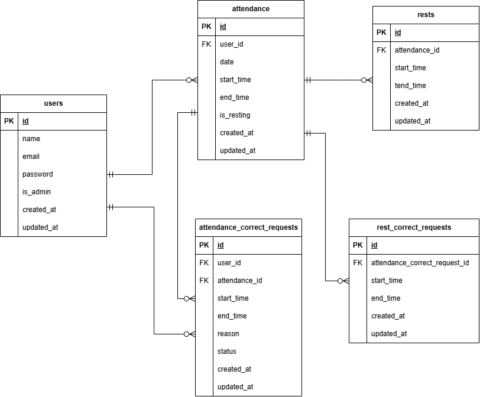

# coachtech 勤怠管理アプリ

企業向けの独自勤怠管理システムです。
社会人全般をターゲットに、日々の出勤・退勤の打刻、および管理者による勤怠管理・修正申請の承認機能を提供することを目的としています。

## 推奨環境
- **ブラウザ**: Chrome / Firefox / Safari (最新版)
- **デバイス**: PC

## 環境構築

### リポジトリのクローンと起動
#### Dockerビルド  
1. `git clone git@github.com:so-akemi/coachtech-attendance.git`
2. `cd coachtech-attendance`  
3. DockerDesktopアプリを立ち上げる  
4. `docker-compose up -d --build`

### Laravel環境構築
#### コンテナ内に入り、依存関係のインストールと初期設定を行います。
- コンテナ内に入る  
`docker compose exec php bash`
- 依存関係のインストール  
`composer install`
- 環境設定ファイルの作成  
`cp .env.example .env`
- アプリケーションキーの生成  
`php artisan key:generate`

### データベース接続設定と構築
####  .envファイルの設定(srcディレクトリ直下)  

- データベース接続設定(下記の通り修正)  
    ```
    DB_CONNECTION=mysql  
    DB_HOST=mysql  
    DB_PORT=3306  
    DB_DATABASE=laravel_db  
    DB_USERNAME=laravel_user  
    DB_PASSWORD=laravel_pass
    ```

- メール認証機能の設定(MAIL_FROM_ADDRESSを修正)
    ```
    MAIL_MAILER=smtp
    MAIL_HOST=mailhog
    MAIL_PORT=1025
    MAIL_USERNAME=null
    MAIL_PASSWORD=null
    MAIL_ENCRYPTION=null
    MAIL_FROM_ADDRESS=admin@example.com
    MAIL_FROM_NAME="${APP_NAME}"
    ```

※ Note: 権限エラーで保存できない場合は、下記コマンドをプロジェクトルート（srcディレクトリ等）で実行してください。 
``` 
sudo chown -R $USER:$USER . 
chmod 664 .env
``` 
(コマンド実行後、ファイルの変更を保存してください)

#### 設定反映後、PHPコンテナ内にて下記コマンドを実行してください。
```
php artisan config:clear
php artisan cache:clear
```

#### マイグレーションとシーディングを実行  
`php artisan migrate --seed`  

### ディレクトリ権限の設定
`chmod -R 777 storage bootstrap/cache`


※エラーが発生した場合は、下記コマンドでコンテナ再起動後、再度php artisan config:clear～php artisan migrate:fresh --seedを実行してください。
```
docker-compose down
docker-compose up -d
```

## 使用技術（実行環境）

- PHP 8.2.11
- Laravel 8.x
- MySQL 8.0.26
- Nginx 1.21.1
- Docker / Docker Compose

## ER図


## URL一覧
### 一般ユーザー用
- ログイン: `http://localhost/login`
- 会員登録: `http://localhost/register`
- 打刻画面: `http://localhost/attendance`
- 勤怠一覧: `http://localhost/attendance/list`
- 申請一覧: `http://localhost/stamp_correction_request/list`

### 管理者用
- 管理者ログイン: `http://localhost/admin/login`
- 勤怠一覧: `http://localhost/admin/attendance/list`
- スタッフ一覧: `http://localhost/admin/staff/list`

### DB
- phpMyAdmin: `http://localhost:8080/`

## 機能一覧
### ユーザー機能
- **認証**: ログイン、ログアウト、会員登録
- **勤怠打刻**: 出勤・退勤の記録（休憩含む）
- **勤怠閲覧**: 自身の勤怠状況の確認、詳細表示
- **修正申請**: 打刻漏れやミスに対する修正申請

### 管理者機能
- **管理者ログイン**: 管理者専用画面へのアクセス
- **勤怠管理**: 全スタッフの勤怠一覧・詳細の閲覧
- **スタッフ管理**: 在籍スタッフのリスト確認
- **承認機能**: ユーザーからの修正申請に対する承認・却下

## テスト用ログイン情報
`php artisan db:seed` 実行後、以下のユーザーが利用可能です。

### 一般ユーザー
- **メールアドレス**: user@example.com
- **パスワード**: testpassword

### 管理者ユーザー
- **メールアドレス**: admin@example.com
- **パスワード**: adminpassword

※動作確認時の注意：
テストユーザー（user@example.com）は、当日の勤怠データが登録されていない状態でシードされます。ログイン後、ホーム画面にて「出勤」ボタンの打刻動作から確認することが可能です。